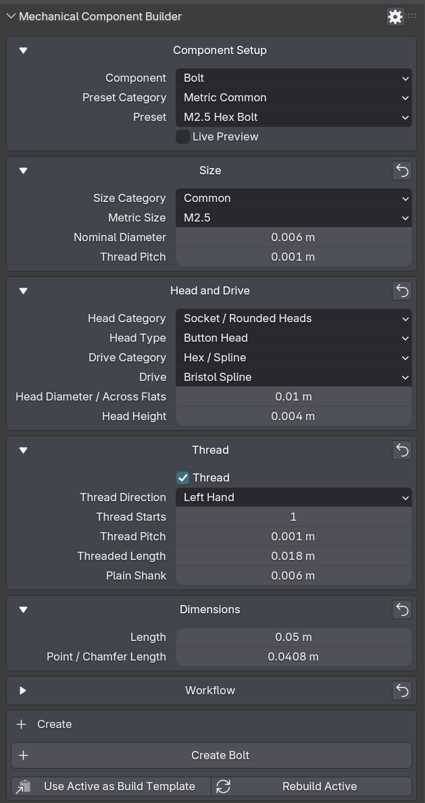

  

 

# DRH - Mechanical Component Builder

### Public Support Hub · Documentation · Feedback · Pre-release Validation

**A Blender utility for generating mechanical hardware components such as fasteners, screws, nuts, washers, and springs, with cutter and assembly workflows.**

 

**Part of the DRH Add-ons ecosystem — Blender tools, updates, and releases.**

<!--

-->

---

**DRH - Mechanical Component Builder** helps Blender users create reusable mechanical hardware components for hard-surface assets, props, vehicles, machinery details, kitbash workflows, and production-style scene detailing.

This repository is the central public hub for support, documentation, issue tracking, compatibility feedback, and community validation before marketplace release.

---

  
<strong>📚 Table of Contents</strong>

## Menu

- [Overview](#overview)
- [Media preview](#media-preview)
- [What DRH - Mechanical Component Builder does](#what-drh---mechanical-component-builder-does)
- [Key features](#key-features)
- [Full feature list](#full-feature-list)
- [Who is it for?](#who-is-it-for)
- [Current status](#current-status)
- [Feedback wanted before release](#feedback-wanted-before-release)
- [Quick links](#quick-links)
- [Before you post](#before-you-post)
- [Where to post](#where-to-post)
- [Support policy](#support-policy)
- [Technical notes](#technical-notes)
- [Availability](#availability)
- [Documentation](#documentation)
- [License](#license)

---

## Overview

**DRH - Mechanical Component Builder** is a Blender workflow utility designed to help users generate reusable mechanical hardware components directly inside Blender.

It is intended for hard-surface artists, Blender asset creators, game artists, vehicle modelers, prop designers, kitbash creators, product visualization artists, mechanical detailers, marketplace asset creators, and users who need screws, fasteners, nuts, washers, springs, cutters, or simple mechanical assemblies for detailed scene work.

Instead of modeling every screw, nut, washer, spring, or related assembly manually from scratch, DRH - Mechanical Component Builder helps turn mechanical hardware creation into a faster, more adjustable, and repeatable workflow.

## Media preview

<!--

---

### Demo video

Replace `YOUTUBE_VIDEO_ID` with your real YouTube video ID.

Example:
https://www.youtube.com/watch?v=YOUTUBE_VIDEO_ID

  
   
  Click the image to watch the demo on YouTube.

-->

<!--
### Quick demo GIF

Recommended size: 1280x720 or 960x540.

  

-->

### Early Screenshots

| Mechanical Component Builder Controls |
|---|
|  |

<!--

  
<strong>More Screenshots...</strong>

| Fastener / Screw Controls | Nut and Washer Controls |
|---|---|
|  |  |

| Spring Controls | Cutter and Assembly Controls |
|---|---|
|  |  |

-->

<!--
### Visual preview

Use this section if you want one large image instead of a gallery.

  

-->

---

## What DRH - Mechanical Component Builder does

DRH - Mechanical Component Builder helps you create, customize, cut, and assemble mechanical hardware components directly inside Blender.

It is not a broad industrial part generator. It is focused on a practical set of reusable mechanical components: fasteners/screws, nuts, washers, and springs, with additional cutter and assembly workflows for integrating those generated components into hard-surface scenes.

Use it to:

- Generate fastener and screw-style components faster
- Create nut components for mechanical detailing
- Create washer components for hardware-style assemblies
- Generate spring components for technical and mechanical assets
- Use cutter options to perform cuts for generated components
- Build simple assemblies using generated components such as fasteners, nuts, washers, and springs
- Create repeated mechanical hardware details without modeling each one manually
- Speed up hard-surface detailing inside Blender

---

### Key Features

- Fast generation of reusable mechanical hardware components directly in Blender
- Focused component workflow for fasteners/screws, nuts, washers, and springs
- Cutter option for performing cuts based on generated components
- Assembly workflow for combining generated hardware elements
- Useful for hard-surface modeling, props, vehicles, machinery details, kitbash sets, and scene detailing
- Adjustable controls for shape, proportion, and variation
- Designed to reduce repetitive mechanical modeling tasks
- Built for Blender artists who need fast, practical, reusable mechanical details

---

  
<strong>🧩 Full feature list</strong>

## Full feature list

### Mechanical Hardware Generation

- In-scene mechanical hardware creation workflow
- Reusable component generation for hard-surface assets
- Mesh-based component creation workflow
- Fast component variation for repeated design tasks
- Useful for asset packs, renders, prototypes, props, and kitbash workflows

### Fasteners / Screws

- Fastener component creation
- Screw-style mechanical components
- Adjustable screw and fastener proportions
- Reusable fastener variations for hard-surface scenes
- Detail elements for props, vehicles, machines, and mechanical assets

### Nuts

- Nut component creation
- Hardware-style nut details
- Reusable nut variations
- Useful for mechanical assemblies, asset detailing, and kitbash workflows

### Washers

- Washer component creation
- Reusable washer-style hardware details
- Useful for fastener assemblies and mechanical detailing
- Supports clean repeated component workflows

### Springs

- Spring component creation
- Reusable spring-style mechanical forms
- Adjustable spring-style proportions
- Useful for technical assets, props, machinery details, and mechanical scene dressing

### Cutter Workflow

- Cutter option for generated components
- Supports cut operations based on generated mechanical hardware
- Useful for integrating screws, fasteners, nuts, washers, and spring-related details into hard-surface models
- Helps prepare component placement and visual fit within Blender scenes

### Assembly Workflow

- Assembly creation using generated components
- Combine fasteners, nuts, washers, springs, or related generated hardware
- Useful for reusable mechanical setups
- Helps create consistent component groups for props, assets, and scene details

### Shape & Proportion Controls

- Component size controls
- Radius and thickness-style controls where applicable
- Length, spacing, or repetition-style controls where applicable
- Visual variation controls for reusable assets
- Proportion-focused workflow for cleaner mechanical forms

### Hard-Surface Detailing

- Mechanical hardware detail generation for Blender scenes
- Reusable hard-surface components
- Detail elements for props, vehicles, machines, sci-fi assets, and kitbash sets
- Fast component iteration workflows
- Asset-friendly component generation for production-style use

### Workflow & UI

- Dedicated component sections
- Practical controls for repeated asset creation
- Cutter and assembly workflow support
- Reset/default workflow support
- Settings and preferences access
- Designed for fast iteration inside Blender

---

## Who is it for?

DRH - Mechanical Component Builder is designed for:

- Hard-surface artists
- Blender asset creators
- Game artists
- Vehicle modelers
- Prop designers
- Product visualization artists
- Kitbash creators
- Mechanical detailers
- Marketplace asset creators
- Users who need screws, fasteners, nuts, washers, springs, cutters, or mechanical assemblies for Blender scenes

---

## Current status

| Item | Details |
|---|---|
| **Status** | 🟣 In Development |
| **Current version** | 1.0.0 |
| **Minimum Blender version** | 4.2.0 |
| **Platforms** | Windows, macOS, Linux |
| **Release type** | In development before public marketplace release |
| **Support repository** | [DRH Mechanical Component Builder Support](https://github.com/pacosalasv/DRH_Mechanical_Component_Builder-Support) |

This add-on is currently in development. Compatibility feedback, usability comments, feature expectations, and workflow suggestions are welcome before public release.

---

## Feedback wanted before release

This repository is open for public feedback before marketplace release.

Feedback is especially welcome on:

- Feature usefulness
- Fastener and screw generation workflows
- Nut generation workflows
- Washer generation workflows
- Spring generation workflows
- Cutter behavior
- Assembly workflows
- Shape and proportion controls
- Hard-surface detailing use cases
- Kitbash and asset pack workflows
- Vehicle, prop, and machinery use cases
- Compatibility concerns
- Installation experience
- Documentation clarity
- Expected pricing
- Marketplace expectations

Useful feedback examples:

> “I would use this to generate repeated screws and hardware details for hard-surface assets.”

> “I need nuts and washers that are easy to reuse across mechanical scenes.”

> “The cutter workflow should make it easier to place generated components into models.”

> “Assemblies would be useful for quickly creating fastener, nut, and washer combinations.”

> “Springs should be easy to adjust and reuse across different props.”

> “The generated components should be easy to edit, place, and reuse in Blender scenes.”

---

## Quick links

- [Support repository](https://github.com/pacosalasv/DRH_Mechanical_Component_Builder-Support)
- [Ask a question in Discussions](https://github.com/pacosalasv/DRH_Mechanical_Component_Builder-Support/discussions)
- [Open a new issue](https://github.com/pacosalasv/DRH_Mechanical_Component_Builder-Support/issues/new/choose)
- [Report a bug](https://github.com/pacosalasv/DRH_Mechanical_Component_Builder-Support/issues/new?template=bug_report.yml)
- [Request a feature](https://github.com/pacosalasv/DRH_Mechanical_Component_Builder-Support/issues/new?template=feature_request.yml)
- [Report a compatibility issue](https://github.com/pacosalasv/DRH_Mechanical_Component_Builder-Support/issues/new?template=compatibility_issue.yml)

---

## Before you post

Please include as much of the following information as possible:

- Add-on version
- Blender version
- Operating system
- Installation method
- Clear steps to reproduce
- Expected result
- Actual result
- Error message, screenshot, or console output when available

For compatibility issues, please also include:

- Blender build type, if known
- Portable or installed Blender version
- Whether the issue happens with a clean Blender configuration
- Component type involved, if relevant
- Fastener, screw, nut, washer, spring, cutter, or assembly workflow involved, if relevant
- Shape or proportion control involved, if relevant
- Whether the issue involves mesh generation, component variation, cutter behavior, assembly creation, UI controls, placement, export, or asset reuse
- Scene complexity, if relevant

---

## Use Discussions for

- Questions
- How-to topics
- Installation help
- Compatibility checks
- FAQ
- Suggestions
- Pre-release feedback
- Pricing feedback
- Workflow ideas

---

## Use Issues for

- Confirmed bugs
- Reproducible compatibility problems
- Fastener or screw generation problems
- Nut generation problems
- Washer generation problems
- Spring generation problems
- Cutter workflow problems
- Assembly workflow problems
- Shape or proportion control issues
- Feature requests
- Regressions
- Marketplace or listing-related problems
- Documentation errors

---

## Where to post

Open a **Discussion** for:

- General questions
- Setup help
- Workflow advice
- Suggestions
- Early feedback

Open an **Issue** for:

- Confirmed bugs
- Reproducible compatibility problems
- Component generation failures
- Fastener, screw, nut, washer, spring, cutter, assembly, mesh, or UI control problems
- Regressions
- Feature requests
- Documentation problems

---

## Support policy

This repository is a public support hub.

Do not post:

- Private account details
- License keys
- Payment information
- Confidential production files
- Private client files
- Sensitive system information

If a private file is required to reproduce an issue, please describe the problem first and wait for further instructions.

---

## Technical notes

This add-on is source based, with:

- No obfuscation
- No binary-only content
- No external services
- No account requirements

Local system access may be used only for normal Blender workflows such as saving files, loading assets, exporting data, or using project resources when applicable.

The add-on is intended to work locally inside Blender.

---

## Availability

This add-on may be available through multiple marketplaces and storefronts after release.

This GitHub repository remains the central public location for:

- Support
- Documentation
- Issue tracking
- Compatibility reports
- Public feedback
- Release notes

---

## Documentation

- [User Manual](docs/manual/user-manual.pdf)
- [Changelog](CHANGELOG.md)

---

## License

This repository is distributed under **GPL-3.0-or-later**.

---

### DRH Add-ons

**Blender tools, updates, and releases.**

Built for clean workflows, practical utilities, and production-friendly Blender setups.

