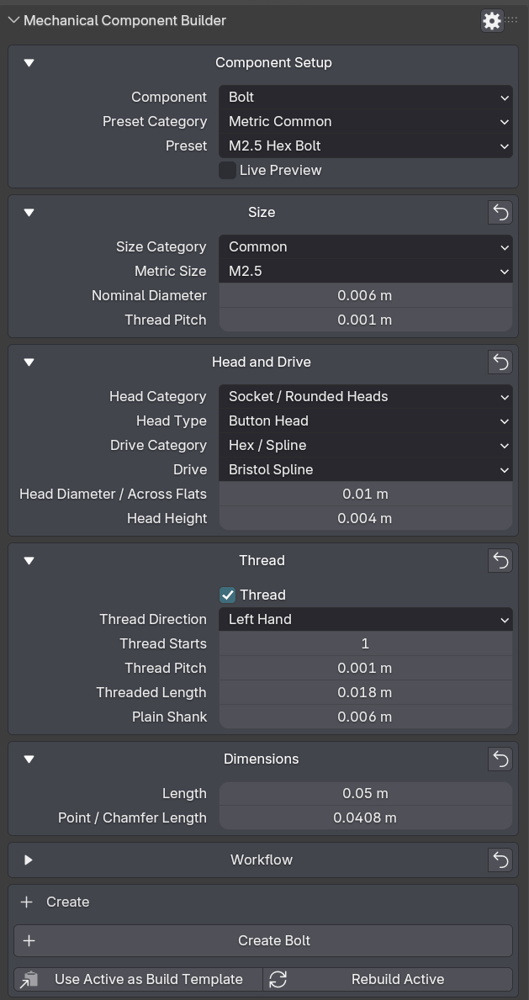

# DRH - Mechanical Component Builder

**Procedural editable bolts, screws, nuts, washers, springs, rivets, studs, rings, and cutters**

   

 

---

## Overview

DRH - Mechanical Component Builder is a Blender workflow utility designed to help users generate reusable mechanical hardware components directly inside Blender.

It is intended for hard-surface artists, Blender asset creators, game artists, vehicle modelers, prop designers, kitbash creators, product visualization artists, mechanical detailers, marketplace asset creators, and users who need screws, fasteners, nuts, washers, springs, cutters, or simple mechanical assemblies for detailed scene work.

## Key features

| Capability |
|---|
| Procedural editable bolts, screws, nuts, washers, springs, rivets, studs, rings, and cutters |

## Detailed features

Open detailed features

### Feature details

#### Mechanical hardware generation
| Details |
|---|
| In-scene mechanical hardware creation workflow |
| Reusable component generation for hard-surface assets |
| Mesh-based component creation workflow |
| Fast component variation for repeated design tasks |
| Useful for asset packs, renders, prototypes, props, and kitbash workflows |

#### Fasteners and screws
| Details |
|---|
| Fastener component creation |
| Screw-style mechanical components |
| Adjustable screw and fastener proportions |
| Reusable fastener variations for hard-surface scenes |
| Detail elements for props, vehicles, machines, and mechanical assets |

#### Nuts

- Nut component creation
- Hardware-style nut details
- Reusable nut variations
- Useful for mechanical assemblies, asset detailing, and kitbash workflows

#### Washers

- Washer component creation
- Reusable washer-style hardware details
- Useful for fastener assemblies and mechanical detailing
- Supports clean repeated component workflows

#### Springs

- Spring component creation
- Reusable spring-style mechanical forms
- Adjustable spring-style proportions
- Useful for technical assets, props, machinery details, and mechanical scene dressing

#### Cutter workflow
- Cutter option for generated components
- Supports cut operations based on generated mechanical hardware
- Useful for integrating screws, fasteners, nuts, washers, and spring-related details into hard-surface models
- Helps prepare component placement and visual fit within Blender scenes

#### Assembly workflow
- Assembly creation using generated components
- Combine fasteners, nuts, washers, springs, or related generated hardware
- Useful for reusable mechanical setups
- Helps create consistent component groups for props, assets, and scene details

#### Shape and proportion controls
| Details |
|---|
| Component size controls |
| Radius and thickness-style controls where applicable |
| Length, spacing, or repetition-style controls where applicable |
| Visual variation controls for reusable assets |
| Proportion-focused workflow for cleaner mechanical forms |

#### Hard-surface detailing
| Details |
|---|
| Mechanical hardware detail generation for Blender scenes |
| Reusable hard-surface components |
| Detail elements for props, vehicles, machines, sci-fi assets, and kitbash sets |
| Fast component iteration workflows |
| Asset-friendly component generation for production-style use |

#### Workflow and UI
| Details |
|---|
| Dedicated component sections |
| Practical controls for repeated asset creation |
| Cutter and assembly workflow support |
| Reset/default workflow support |
| Settings and preferences access |
| Designed for fast iteration inside Blender |

## Product status

| Item | Details |
|---|---|
| Status | **Development On Hold** |
| Version | 1.0.0 |
| Blender | 4.2+ |
| Platforms | Windows, macOS, Linux |
| Availability | Development is currently on hold; no public download is promoted from this repository. |
| Distribution | Support, documentation, and development history. |
| Repository role | Documentation, support, issue tracking, compatibility feedback, and product feedback |

The repository remains available for documentation and feedback while active development is paused.

## Media

Product screenshots:

  

## Documentation and support

| Resource | Link |
|---|---|
| Support guide | [SUPPORT.md](SUPPORT.md) |
| User manual | [PDF manual](docs/manual/user-manual.pdf) |
| Repository changelog | [CHANGELOG.md](CHANGELOG.md) |
| Issues | [Open or review issues](https://github.com/pacosalasv/DRH_Mechanical_Component_Builder-Support/issues) |
| Discussions | [Ask questions and share feedback](https://github.com/pacosalasv/DRH_Mechanical_Component_Builder-Support/discussions) |

## Support development

Support is optional. Ko-fi and PayPal contributions help fund maintenance, Blender compatibility work, documentation, testing, and continued development of free DRH tools.

  
   
  <strong>Prefer PayPal?</strong> <a href="https://www.paypal.com/paypalme/pacosalas?locale.x=en_US&country.x=MX">Support DRH development with PayPal</a>

## Ecosystem

| Destination | Link |
|---|---|
| Support development | [Ko-fi](https://ko-fi.com/pacosalasv) |
| PayPal | [Support development](https://www.paypal.com/paypalme/pacosalas?locale.x=en_US&country.x=MX) |
| Issues & feedback | [GitHub Issues](https://github.com/pacosalasv/DRH_Mechanical_Component_Builder-Support/issues) |
| DRH Add-ons Hub | [Catalog and roadmap](https://github.com/pacosalasv/DRH_Addons_Hub) |
| BlendKit | [DRH Blender catalog](https://www.blendkit.com/?query=author_id:205846) |
| Paco Salas \| DRH | [Official site](https://pacosalasv.blogspot.com/) |
| Xtreme Mindset | [Product lab](https://xtrememindset.blogspot.com/) |
| Sketchfab / Código Píxel | [3D model collections](https://sketchfab.com/codigopixel/collections) |
| KreaOn | [Technology education](https://www.kreaon.com/) |
| PiNu | [Connected physical products](https://pinu.com.mx/) |
| GitHub | [pacosalasv](https://github.com/pacosalasv) |

## License

See [LICENSE](LICENSE) for repository licensing terms.
